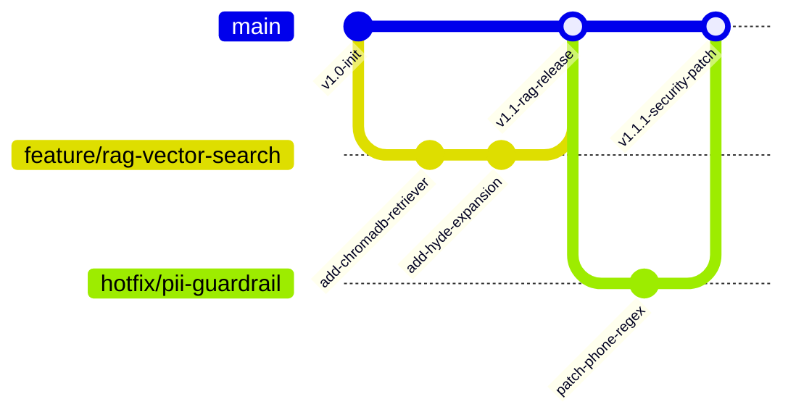

# 🐙 Complete Git, GitHub & CI/CD Master Guide for AI Engineers & FDEs

---

## 📖 Table of Contents
1. [Introduction: Why Git & CI/CD are Non-Negotiable for FDEs](#1-introduction-why-git--cicd-are-non-negotiable-for-fdes)
2. [Git Core Concepts & Architecture](#2-git-core-concepts--architecture)
3. [Complete Git Command Reference (Basics to Advanced)](#3-complete-git-command-reference-basics-to-advanced)
4. [Git LFS (Large File Storage) for AI Models & Vector DBs](#4-git-lfs-large-file-storage-for-ai-models--vector-dbs)
5. [Enterprise Branching Strategies (Trunk-Based vs GitFlow)](#5-enterprise-branching-strategies-trunk-based-vs-gitflow)
6. [GitHub Actions CI/CD for Production AI Pipelines](#6-github-actions-cicd-for-production-ai-pipelines)
7. [FDE Best Practices & Troubleshooting Checklist](#7-fde-best-practices--troubleshooting-checklist)

---

## 1. Introduction: Why Git & CI/CD are Non-Negotiable for FDEs

As a **Forward-Deployed Engineer (FDE)** at companies like Microsoft, Palantir, or OpenAI, you deploy code directly into enterprise production environments. Git is not just for saving code—it is your **audit trail, collaboration protocol, release manager, and safety net**.

### Key FDE Requirements Handled by Git & CI/CD:
* **Auditability & Traceability**: Every LLM prompt engineering change, RAG vector index adjustment, and security guardrail rule must be attributed to an author and commit hash.
* **GitOps for AI Deployments**: Deploying microservices to Kubernetes or Azure WebApp automatically upon merging pull requests.
* **Automated Quality & Security Gates**: Running unit tests, evaluation suites (Ragas), PII scrubbing checks, and Docker builds before merging code.

---

## 2. Git Core Concepts & Architecture

Git tracks changes in a Directed Acyclic Graph (DAG) of commits.



### The 4 Git States:
1. **Working Directory**: Your local files currently being edited.
2. **Staging Area (Index)**: Files prepared to be included in the next commit (`git add`).
3. **Local Repository**: Committed history stored in `.git/` on your computer (`git commit`).
4. **Remote Repository**: Shared repository on GitHub/GitLab (`git push`).

---

## 3. Complete Git Command Reference (Basics to Advanced)

### 🔹 Basic Workflow Commands

```bash
# Initialize a new Git repository
git init

# Clone a remote repository from GitHub
git clone https://github.com/org/repo-name.git

# Check working directory and staging status
git status

# Stage specific file or all files
git add server/agent.js
git add .

# Commit staged changes with conventional commit message
git commit -m "feat(rag): add HyDE query expansion for 6D scent vectors"

# Push local commits to remote branch
git push origin main

# Pull latest changes from remote
git pull origin main
```

---

### 🔹 Intermediate Branching & Merging

```bash
# List all local and remote branches
git branch -a

# Create and switch to a new feature branch
git checkout -b feature/llm-gateway-failover
# Modern alternative:
git switch -c feature/llm-gateway-failover

# Merge feature branch into current branch
git checkout main
git merge feature/llm-gateway-failover

# Rebase feature branch onto updated main (creates clean linear history)
git checkout feature/llm-gateway-failover
git rebase main

# Abort a rebase in case of complex conflicts
git rebase --abort
```

---

### 🔹 Advanced FDE Git Commands

```bash
# 1. Stash uncommitted work temporarily
git stash push -m "WIP: RAG reranker experiment"
git stash list
git stash pop

# 2. Cherry-pick a specific bugfix commit from another branch
git cherry-pick a1b2c3d4

# 3. Interactive Rebase (Squash, edit, or reorder last 4 commits)
git rebase -i HEAD~4

# 4. Git Bisect (Binary search to locate exact commit that introduced a bug)
git bisect start
git bisect bad                 # Current commit has bug
git bisect good v1.0.0         # Known good release tag
# Git automatically checks out commits; run tests, mark 'git bisect good' or 'git bisect bad'
git bisect reset

# 5. Undo operations safely
git reset --soft HEAD~1        # Undo commit, keep changes in staging area
git reset --hard HEAD~1        # CAUTION: Undo commit and discard all local changes
git revert a1b2c3d4            # Create a NEW commit that reverses a previous commit (safe for shared branches)

# 6. Inspecting history & reflog
git log --oneline --graph --all
git reflog                     # Emergency recovery log of all HEAD movements (recovers deleted commits!)
```

---

## 4. Git LFS (Large File Storage) for AI Models & Vector DBs

Git is designed for text files. Storing large `.bin`, `.safetensors`, `.onnx`, or `.parquet` files directly in Git inflates repository size and slows down clones. **Git LFS** replaces large files with tiny pointer files in Git while storing binary payloads on dedicated LFS servers.

```bash
# Install Git LFS
git lfs install

# Track large model weights and vector embeddings
git lfs track "*.onnx"
git lfs track "*.safetensors"
git lfs track "*.parquet"
git lfs track "data/*.db"

# Ensure .gitattributes is committed
git add .gitattributes
git commit -m "chore: configure Git LFS for ONNX embeddings and vector databases"
git push origin main
```

---

## 5. Enterprise Branching Strategies (Trunk-Based vs GitFlow)

### Trunk-Based Development (Recommended for Fast-Paced FDE Delivery)
All FDEs commit to short-lived feature branches (`feature/*`) that are merged into `main` multiple times per day via Pull Requests (PRs). Automated CI/CD runs test suites on every PR.

```
main  ─────────────────●──────────●──────────●─────────► [Auto-Deploy to Prod]
                       ▲          ▲          ▲
feature/rag-fix ───────┘          │          │
feature/pii-guard ────────────────┘          │
feature/gateway ─────────────────────────────┘
```

---

## 6. GitHub Actions CI/CD for Production AI Pipelines

Create `.github/workflows/deploy.yml` in your repository to automate linting, unit testing, 100-case evals, Docker builds, and deployment.

```yaml
name: Enterprise AI Platform CI/CD Pipeline

on:
  push:
    branches: [ main ]
  pull_request:
    branches: [ main ]

jobs:
  test-and-evaluate:
    name: 🧪 Unit Tests & Ragas LLMOps Evals
    runs-on: ubuntu-latest

    steps:
      - name: 📥 Checkout Repository
        uses: actions/checkout@v4

      - name: 🟢 Setup Node.js Environment
        uses: actions/setup-node@v4
        with:
          node-version: '20'
          cache: 'npm'

      - name: 📦 Install Dependencies
        run: npm ci

      - name: 🔍 Run ESLint & Security Check
        run: npm run lint || true

      - name: 🚀 Start Server in Background
        run: |
          node server/index.js &
          sleep 3

      - name: 📊 Execute 100-Case Automated Test Suite
        run: node scratch/run_100_case_test_matrix.js

  build-and-deploy:
    name: 🐳 Docker Build & Production Vercel Deploy
    needs: test-and-evaluate
    if: github.ref == 'refs/heads/main'
    runs-on: ubuntu-latest

    steps:
      - name: 📥 Checkout Code
        uses: actions/checkout@v4

      - name: 🐳 Build Docker Container
        run: docker build -t aura-perfumery-ai:latest .

      - name: 🚀 Deploy to Vercel Production
        uses: amondnet/vercel-action@v25
        with:
          vercel-token: ${{ secrets.VERCEL_TOKEN }}
          vercel-org-id: ${{ secrets.VERCEL_ORG_ID }}
          vercel-project-id: ${{ secrets.VERCEL_PROJECT_ID }}
          vercel-args: '--prod'
```

---

## 7. FDE Best Practices & Troubleshooting Checklist

| Scenario | Recommended Command / Action |
| :--- | :--- |
| **Accidentally committed API key / Secret** | Remove from history using `git filter-repo` or BFG Repo-Cleaner. Immediately rotate the key! |
| **Merge conflict in `package-lock.json`** | Run `git checkout --ours package-lock.json` followed by `npm install`. |
| **Need to inspect changes between two tags** | Run `git diff v1.0.0..v1.1.0`. |
| **Branch diverged from `origin/main`** | Run `git fetch origin` then `git rebase origin/main`. |
